# A Cook Log - Pit Barrel Chicken Thighs and Potato Boat
This photo essay captures the weekend afternoon cook of chicken thighs and potatoes (in boat format).

## Light the Pit Barrel Cooker
Use just forty (40) briquettes in the chimney to get the BBQ lit.  
I count them :) 

New (and Pit Barrel branded) chimneys are smaller, so just fill them up. You can see, I have a big one!

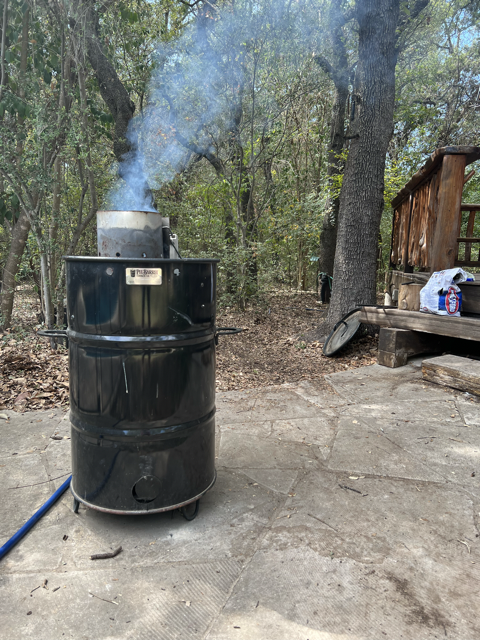

When the charcoal is ready, carefully dump it into the basket of charcoal waiting at the bottom of the pit barrel.

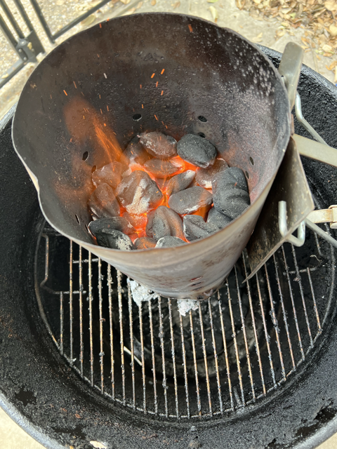

Keep the Rods in place to limit air flow. The PBC (Pit Barrel Cooker) is designed to limit air flow and keep the rods in place unless you want a higher heat and faster cook (like steak or chicken wings).

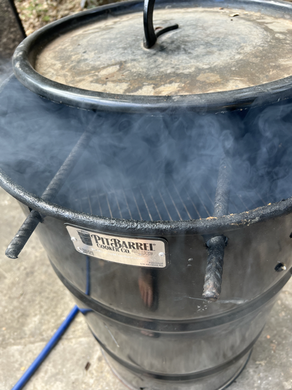

Typically your PBC will burn that Kingsford charcoal for approx 6 hours. It is recommended to use the long burn time to make more chicken thighs or roast more vegetables to be eaten in the coming days.

## Back in the Kitchen - Chicken and Potatoes
Two grilling object types to prepare, chicken thighs (10) and a (1) potato boat.

It seems the chicken should get out of it's factory plastic and allowed to breath with some large grain salt product (like Adams Reserve - House) and something with colour (like cajun or Salt Lick dry run).   

Keep the chicken away from the dogs. 

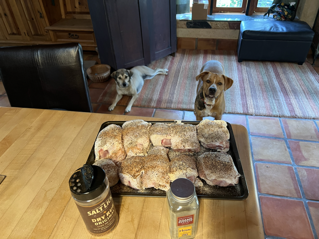

Chop up the Potatoes and almost always use a sweet potato (they are awesome).

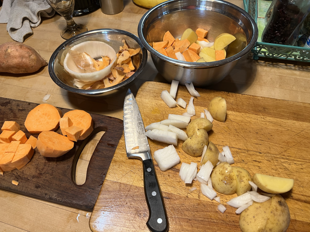

Use chili peppers (not just "peppers") and fresh garlic (find errors in this photo.)

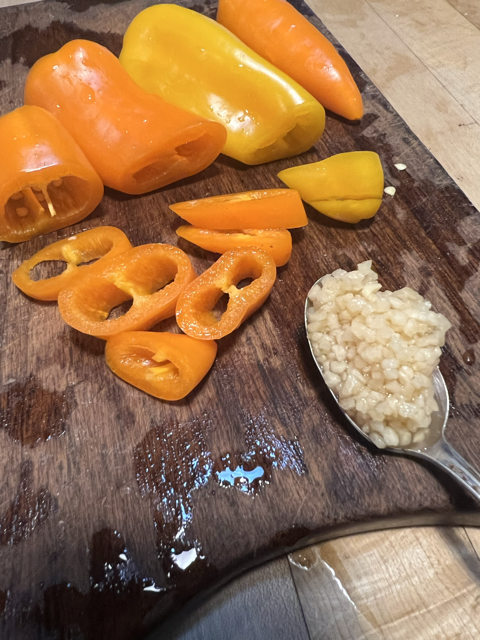

Potato boats can be very bland coloured unless you specifically make an effort. Not all vegetables have flavour, although purple.

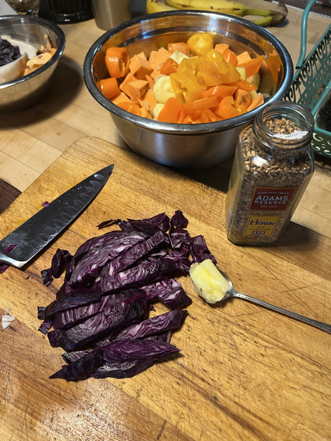

## Build the Potato Boat
The potato boat is a basic construct of BBQ living. Put your vegetables in tin foil and let the heat + water do all the cooking and cleaning. Thank you tin foil gods. 

After seasoning, don't forget butter, even some oil? Now you can splay it out on a sheet of tin foil. Just hope it is long enough to contain your ingredients.

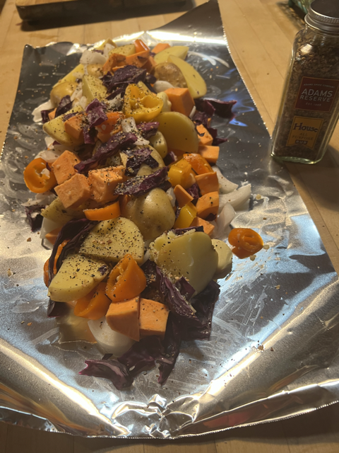

Now the crux are the 2-3 folds (known as Grand Pappy's Double Fold) that must be meticulously made on the two long edges. 

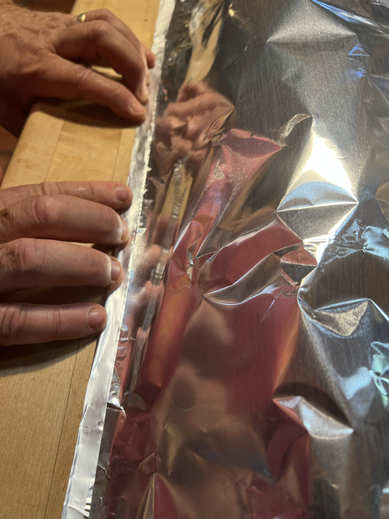

Without two+ excellent folds, your potato boat will inevitably explode when you flip it over or otherwise handle it.

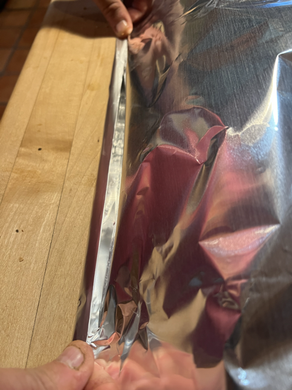

Do not skimp on those side folds, if it takes it, fold up that last edge.

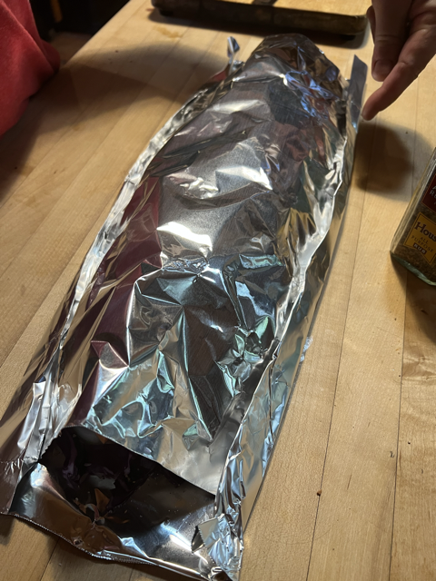

Finally fold the ends. Be sure to get at least two awesome folds for boat safety.

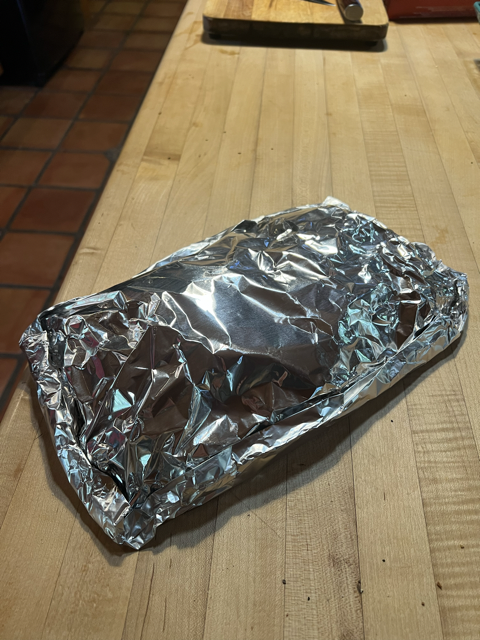

## Deploy to Grill

Now the heat is on. 

Put those thighs on the grill.

We start and end with skin side up.

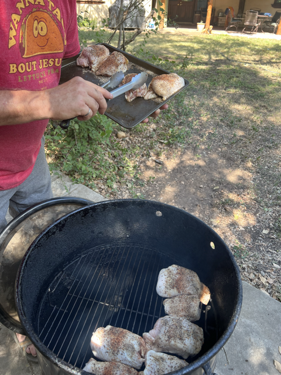

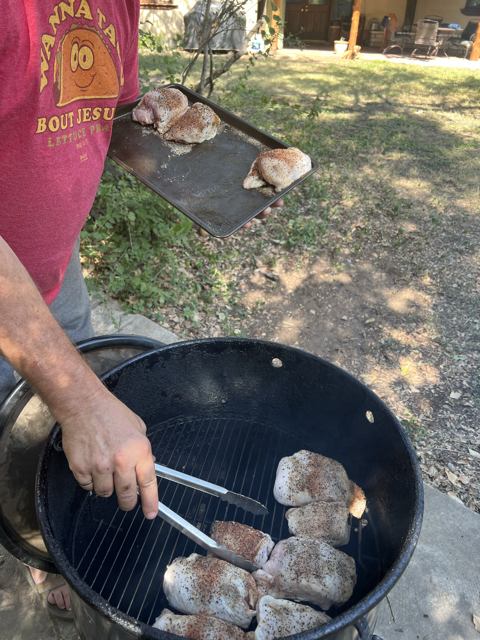

Add the potato boat beside the thighs.

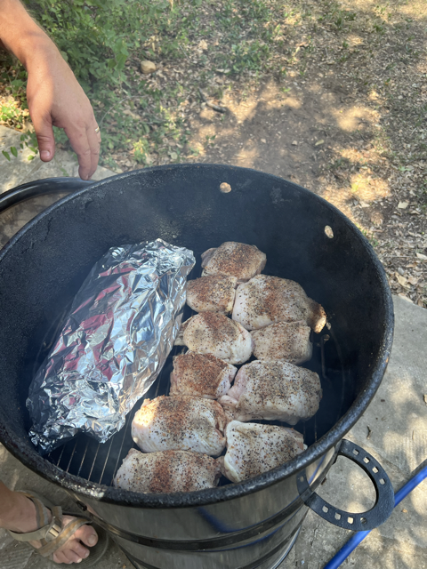

Close the lid and let it cook.

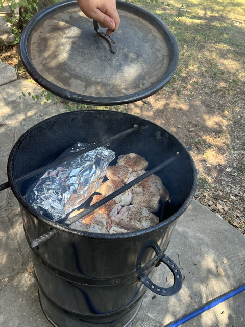

After 15 minutes, turn (not flip) the chicken 90 degrees to get grill marks. I often spin the grate around a bit to move different chicken to the hotter areas.

After another 15 minutes (30 minutes since deployment), flip the thighs over.

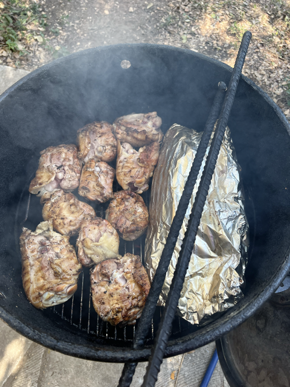

After another 15 minutes (45 minutes into trip), turn (not flip) the chicken again for the grate marks.

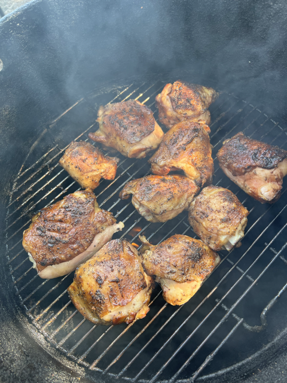

Get your Stubb's out.

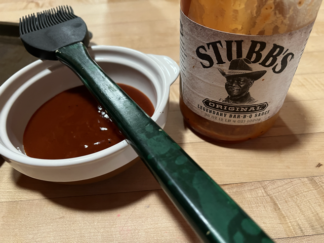

Get those thighs hot.

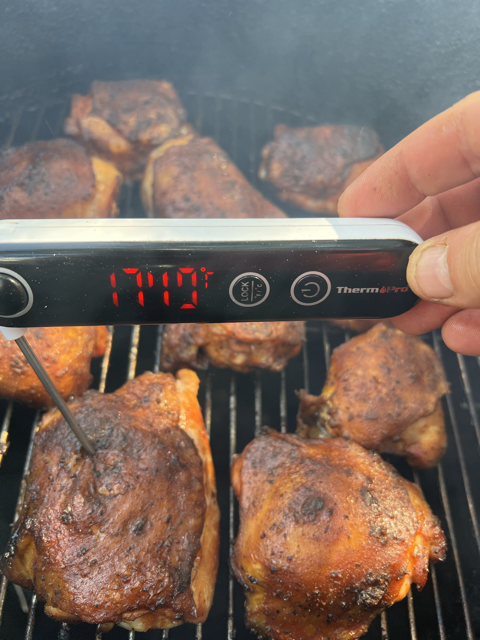

## The Chicken is Ready!
Take it off the grill, and let it rest.

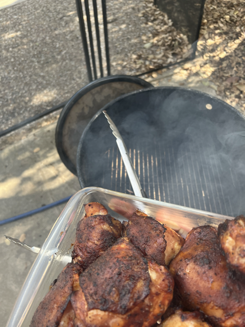

Chicken and Boat are together again.

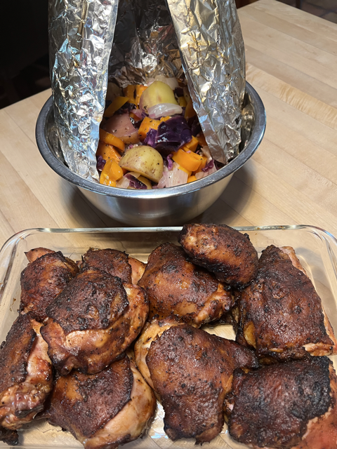

